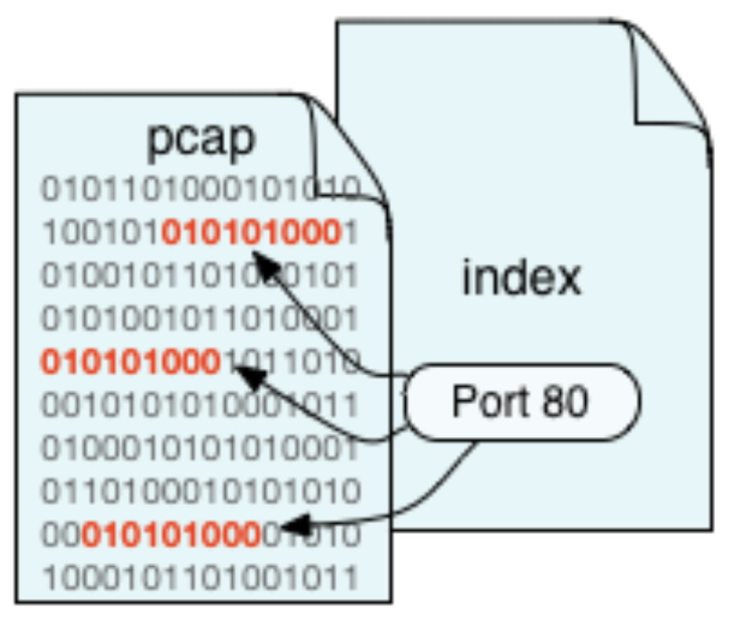
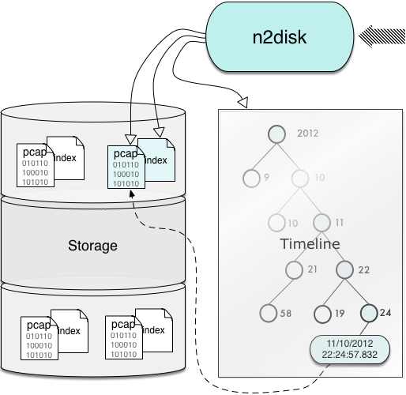

Main Features
=============

Some of the n2disk features include:

- Fully user configurable.
- Use of the standard PCAP file format (regular and nanosecond).
- Ability to compress PCAP on-the-fly producing .npcap files.
- High-performance packet to disk recording.
- BPF filters supports (using the same format as in the popular tcpdump tool) to filter out the unwanted network packets from the recording process.
- Optimised BPF-like filters support, a faster replacement for BPF filters (a subset of the BPF syntax is supported).
- Multi-core support. n2disk has been designed with multicore architectures in mind. It uses at least 2 threads (one for the packet capture and one for the disk writing) and it is possible to further parallelise traffic processing using multiple threads. The communication between threads has been carefully optimised.
- PF_RING_ acceleration. n2disk exploit the packet capture acceleration offered both by standard PF_RING and PF_RING ZC.
- Direct-IO disk access. n2disk uses the Direct IO access to the disks in order to obtain maximum disk-write throughput.
- Real-Time indexing. n2disk is able to produce an index on-the-fly. The index can be queried using a BPF-like syntax to quickly retrieve interesting packets in a specified time interval.

.. _PF_RING: http://www.ntop.org/guides/pf_ring

Dump Format
-----------

Capture files are saved in the standard PCAP format with timestamps in microsecond resolution. The PCAP format with nanosecond resolution is also an option when using the PF_RING support and network cards with hardware timestamp. 

Capture files are stored in sequential order with a per-file limit in duration or size. It is also possible to specify the maximum number of files: when the limit is reached, n2disk recycles the files already written, starting from the oldest one.

Capture Filters
---------------

n2disk uses the same syntax for capture filters as tcpdump and any other program that uses the libpcap library. In fact two type of capture filters are available:

- Standard BPF filters.
- BPF-like filters (a subset of the BPF syntax), a faster replacement for BPF. Please check the Packet Filtering section for syntax information.

Index and Post-Capture Filters
------------------------------

n2disk produces an index on-the-fly during packet capture. The index is in a separate file associated with the capture file and houses all the flows information and packets offsets. 
As soon as the dump file is ready, using the utilities provided with n2disk, it is possible to query the index for specific packets in a time interval using a BPF-like syntax. The packets matching the filter are returned in PCAP format.

Timeline
--------

Besides the per-dump-file index, n2disk can also produce a timeline, a way of keeping the whole captured traffic in chronological order.
Using the utilities provided with n2disk, it is possible to query the timeline for specific packets belonging to the whole dump set in a given time interval.

