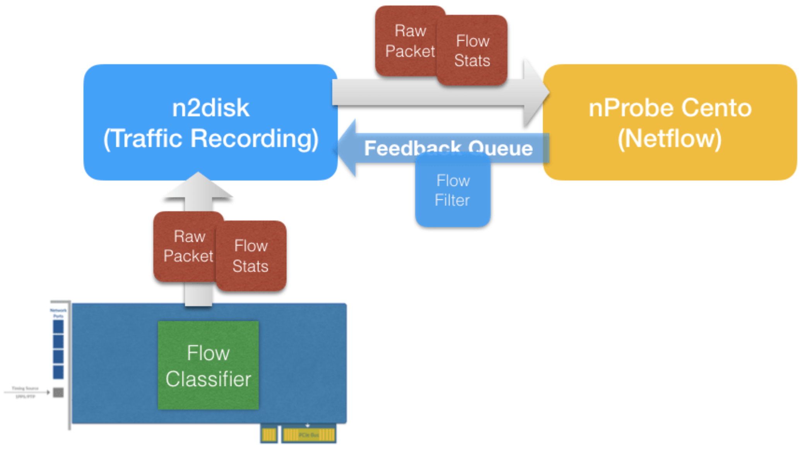

Netflow and Raw Recording
=========================

If you want to combine Netflow and raw traffic recording, you have two options:

1. Run nProbe Cento for Netflow generation, and forward raw traffic from nProbe Cento to n2disk for recording (recommended when the rate of the traffic to be recorded is low)
2. Use an adapter with flow-offload capabilities (e.g. Accolade) and run n2disk for traffic recording, forwarding flow updates to nProbe Cento for Netflow generation

nProbe Cento to n2disk
----------------------

nProbe Cento, the 1/10/40/100 Gbit NetFlow/IPFIX Probe, Traffic Classifier, and Packet Shunter, integrates straightforwardly with n2disk to generate Netflow while selectively writing raw data to disk. 
Both nProbe Cento and nProbe have been designed to fully exploit the resources provided by multi-core systems, aggregating traffic that comes from multiple, independent input queues in the former, scattering packet processing on multiple cores in the latter.
Let’s say for instance that nProbe Cento has to be used as a flow exporter for a v9 NetFlow collector listening on 192.168.2.221 port 2055 and, at the same time, has to aggregate monitored traffic received from four different eth1 queues into a single aggregated egress queue. Then the following command can be issued

.. code-block:: console

   cento-ids -i zc:eth1@[0-3] —aggregated-egress-queue --v9 192.168.2.221:2055

Upon successful startup, nProbe Cento will output the ZC egress queue identifier that needs to be passed to n2disk, in the format zc:<cluster id>:<queue id>. Assuming nProbe Cento assigned identifier zc:10@0 to the aggregated-egress-queue, it is possible to record egress traffic via n2disk using the following command:

.. code-block:: console

   n2disk -i zc:10@0 --dump-directory /storage -—max-file-len 1024 --buffer-len 2048 --chunk-len 4096 --reader-cpu-affinity 4 --writer-cpu-affinity 5 --index --index-version 2 --timeline-dir /storage

Where -i zc:10@0 is the n2disk ingress queue, that is the egress queue of nProbe Cento.
The user has a fine-grained control over the traffic that gets actually forwarded to the egress queue by nProbe Cento, for instance to avoid forwarding encrypted traffic (e.g., SSL, HTTPS) to n2disk for recording, or to forward only the traffic that comes from a suspicious range of addresses. This is enforced in nProbe Cento through a set of rules that can be applied at different levels (per queue, per subnet, per application protocol) specified using a configuration file (—egress-conf option) that follows the INI standard. Example:

.. code-block:: console

   cento-ids -i zc:eth1@[0-3] --aggregated-egress-queue —egress-conf egress.example --dpi-level 2 --v9 192.168.2.221:2055

To learn more about aggregates egress queues and configurations please refer to the nProbe Cento User’s Guide.

n2disk to nProbe Cento with Flow-Offload
----------------------------------------

Since PF_RING version 7.0 and n2disk version 3.0, it is possible to offload flow processing to the network card (on supported adapters) reducing CPU utilisation. Using flow offload the network card can be programmed to:

1. Keep flow state, doing flow classification in hw.
2. Periodically provide informations like hash, packets, bytes, first/last packet timestamp, tcp flags, to the application.
3. Drop/bypass/mark flow packets.

n2disk is able to record raw data while feeding nProbe Cento with flow updates. In addition to flow updates, when nDPI is enabled in nProbe Cento for L7 protocol detection, n2disk can also forward raw traffic, using a feedback queue for shunting flow packets as soon as the nDPI engine detects the protocol. 

By leveraging on this technology, it is possible to do traffic recording and Netflow generation at high speed on the same box with low CPU utilization.

For example, if we want to run n2disk on an Accolade card featuring flow offload support, and export flow updates to nProbe Cento, we need to add the —export-flow-offload option, specifying a cluster id that is used for allocating a ZC queue for forwarding flow updates and raw data from n2disk to nProbe Cento:

.. code-block:: console

   n2disk -i anic:0 -o /storage/n2disk -p 1024 -b 4096 -C 4096 -c 0 -w 1 --disk-limit 80% --export-flow-offload 99

After n2disk is running, we can attach nProbe Cento to the ZC queue for receiving the flow updates using zc:<cluster id> as interface name, and adding the —flow-offload option:

.. code-block:: console

   cento -i zc:99@0 --flow-offload -P /storage/cento

